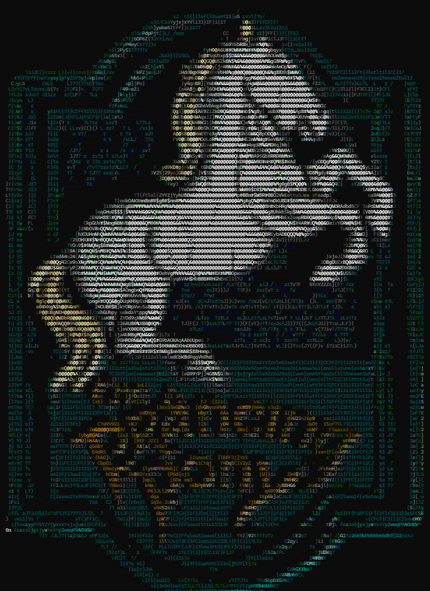
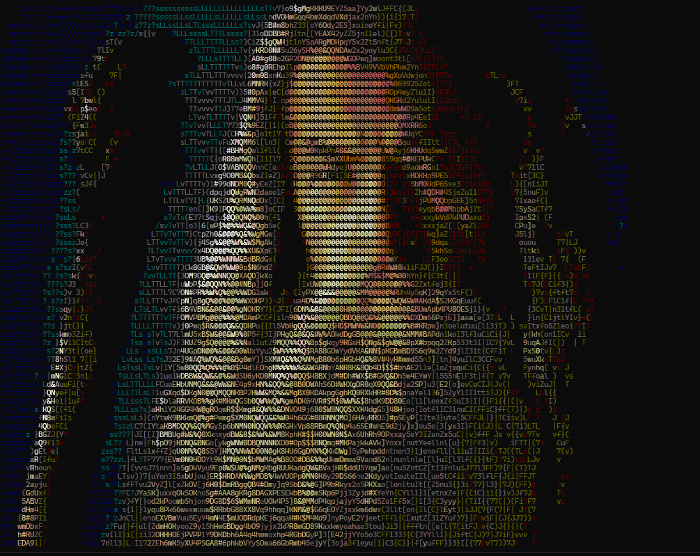

# DOCKER GAME - LOTR

Could learning Docker have some kind of fun?

This is an attempt of answering 'yes' to that question.

You'll find here a version of a DIND (Docker in Docker) image that will allow to create a container running a console game for learning Docker

## How to run it

The instructions for running the game are pretty simple

1. Clone the repository
1. Build the image
1. Run it
1. Access it

Required commands are similar to these...

For cloning the repo:
```
git clone git@github.com:lmayala/lotr.git
```

Bulding the image, assuming you'll name it 'lotr':

```
docker build . -t lotr
```

Running it (assuming you'll create the container with the same name as the image):
```
docker run -d --name lotr --privileged lotr
```
Be aware that the flag **--privileged** is required for the container to run Docker properly inside of it

Accessing the container
```
docker exec -it lotr /bin/bash
```

## Requirements

The game has been tested under Linux and Windows and works fine in any environment.
Image takes around 1Gb for running a container with several containers inside
For visualization, you may need a console screen with a minimum of 150 columns


## The game - Docker perspective

The game focus on the early steps when learning Docker. Ideally it should be complemented with some documentation mainly focusing on learning about images, containers, their differences and basic commands.
The goes through some stages including:

1. Identifying existent containers
1. Accessing containers through console
1. Creating containers based on existing images
1. Creating new images with very basic dockerfiles. 


## The game - Player perspective




The environment for the game is the first part of Frodo's travel with The Ring.
Everything happens between The Shire and Rivendel.
Frodo and the hobbits will be pursued by the evil Nazgûls and they should reach The Prancing Pony before meeting Aragorn.
Finally they should continue their path to Rivendel.

Each of the stages will present new challenges that need to be completed before advancing to next stage.


